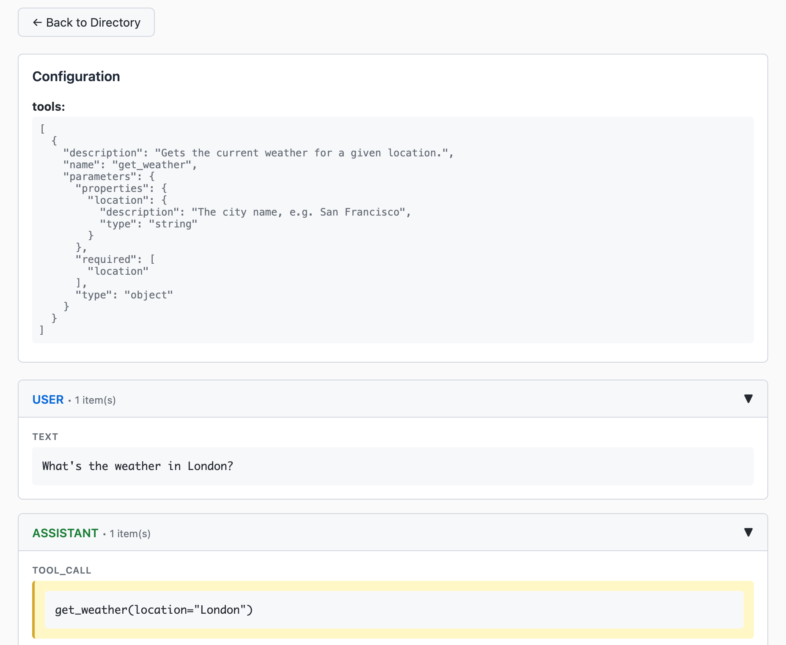
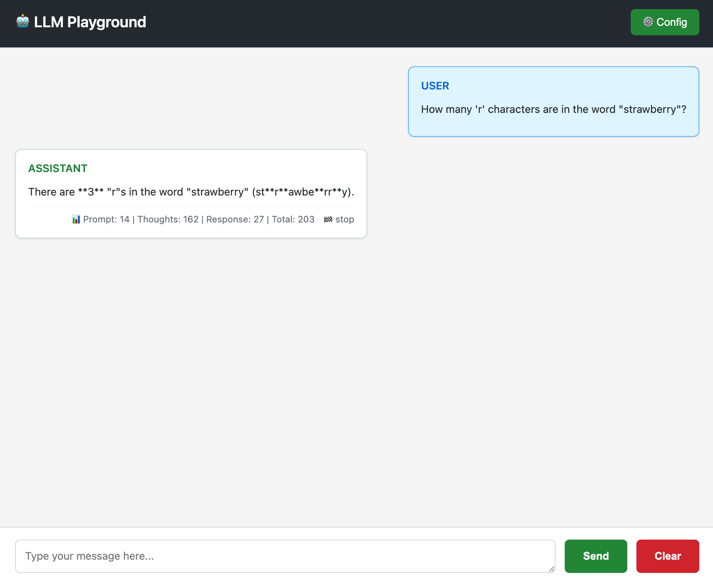

# AgentHub SDK - Unified and Precise LLM SDK

[](https://github.com/Prism-Shadow/AgentHub/stargazers)
[](https://github.com/Prism-Shadow/AgentHub/commits/main)
[](https://github.com/Prism-Shadow/AgentHub/graphs/contributors)
[](https://github.com/Prism-Shadow/AgentHub/actions/workflows/pytest.yml)
[](https://github.com/Prism-Shadow/AgentHub/actions/workflows/jest.yml)
[](https://pypi.org/project/agenthub-python/)
[](https://www.npmjs.com/package/@prismshadow/agenthub)

AgentHub SDK is the only SDK you need to connect to state-of-the-art LLMs.

📢 Follow us on X: [](https://twitter.com/prismshadow_ai) or join our [Discord Community](https://discord.gg/4TQ2bsSb)

https://github.com/user-attachments/assets/c49a21a1-5bf9-4768-a76d-f73c9a03ca87

## Why AgentHub?

- 🔗 **Unified**: A consistent and intuitive interface for developing **agents** across different LLMs.

- 🎯 **Precise**: Automatically handles **[interleaved thinking](https://platform.claude.com/docs/en/build-with-claude/extended-thinking#interleaved-thinking)** during multi-step tool calls, preventing performance degradation.

- 🧭 **Traceable**: Provides lightweight yet fine-grained **tracing** for debugging and auditing LLM executions.

## Supported Models

| Model Name     | Vendor                          | Reasoning          | Tool Use           | Image Understanding           |
| -------------- | ------------------------------- | ------------------ | ------------------ | ----------------------------- |
| Gemini 3       | Official                        | :white_check_mark: | :white_check_mark: | :white_check_mark:            |
| Claude 4.5     | Official                        | :white_check_mark: | :white_check_mark: | :white_check_mark:            |
| GPT-5.2        | Official                        | :white_check_mark: | :white_check_mark: | :white_check_mark:            |
| GLM-4.7        | Official/OpenRouter/SiliconFlow | :white_check_mark: | :white_check_mark: | :negative_squared_cross_mark: |
| Qwen3          | OpenRouter/SiliconFlow/vLLM     | :white_check_mark: | :white_check_mark: | :negative_squared_cross_mark: |

## Installation

### Python package

Install from PyPI:

```bash
uv add agenthub-python
# or
pip install agenthub-python
```

Build from source:

```bash
cd src_py && make
```

See [src_py/README.md](src_py/README.md) for comprehensive usage examples and API documentation.

### TypeScript package

Install from npm:

```bash
npm install @prismshadow/agenthub
```

Build from source:

```bash
cd src_ts && make install && make build
```

See [src_ts/README.md](src_ts/README.md) for comprehensive usage examples and API documentation.

## APIs

`AutoLLMClient` is the main class for interacting with the AgentHub SDK. It provides the following methods:

- `(async) streaming_response(messages, config)`: Streams the response of LLMs in a stateless manner.
- `(async) streaming_response_stateful(message, config)`: Streams the response of LLMs in a stateful manner.
- `clear_history()`: Clears the history of the stateful LLM client.
- `get_history()`: Returns the history of the stateful LLM client.

## Basic Usage

> [!NOTE]
> We recommend using the **stateful interface** when calling the AgentHub SDK.

### OpenAI GPT-5.2

Python Example:

```python
import asyncio
import os
from agenthub import AutoLLMClient

os.environ["OPENAI_API_KEY"] = "your-openai-api-key"

async def main():
    client = AutoLLMClient(model="gpt-5.2")
    async for event in client.streaming_response_stateful(
        message={
            "role": "user",
            "content_items": [{"type": "text", "text": "Say 'Hello, World!'"}]
        },
        config={"temperature": 1.0}
    ):
        print(event)

asyncio.run(main())
# {'role': 'assistant', 'event_type': 'delta', 'content_items': [{'type': 'text', 'text': 'Hello'}], 'usage_metadata': None, 'finish_reason': None}
# {'role': 'assistant', 'event_type': 'delta', 'content_items': [{'type': 'text', 'text': ','}], 'usage_metadata': None, 'finish_reason': None}
# {'role': 'assistant', 'event_type': 'delta', 'content_items': [{'type': 'text', 'text': ' World'}], 'usage_metadata': None, 'finish_reason': None}
# {'role': 'assistant', 'event_type': 'delta', 'content_items': [{'type': 'text', 'text': '!'}], 'usage_metadata': None, 'finish_reason': None}
# {'role': 'assistant', 'event_type': 'stop', 'content_items': [], 'usage_metadata': {'prompt_tokens': 12, 'thoughts_tokens': 0, 'response_tokens': 8, 'cached_tokens': 0}, 'finish_reason': 'stop'}
```

TypeScript Example:

```typescript
import { AutoLLMClient } from "@prismshadow/agenthub";

process.env.OPENAI_API_KEY = "your-openai-api-key";

async function main() {
  const client = new AutoLLMClient({ model: "gpt-5.2" });
  for await (const event of client.streamingResponseStateful({
    message: {
      role: "user",
      content_items: [{ type: "text", text: "Say 'Hello, World!'" }]
    },
    config: {}
  })) {
    console.log(event);
  }
}

main().catch(console.error);
// {'role': 'assistant', 'event_type': 'delta', 'content_items': [{'type': 'text', 'text': 'Hello'}], 'usage_metadata': null, 'finish_reason': null}
// {'role': 'assistant', 'event_type': 'delta', 'content_items': [{'type': 'text', 'text': ','}], 'usage_metadata': null, 'finish_reason': null}
// {'role': 'assistant', 'event_type': 'delta', 'content_items': [{'type': 'text', 'text': ' World'}], 'usage_metadata': null, 'finish_reason': null}
// {'role': 'assistant', 'event_type': 'delta', 'content_items': [{'type': 'text', 'text': '!'}], 'usage_metadata': null, 'finish_reason': null}
// {'role': 'assistant', 'event_type': 'stop', 'content_items': [], 'usage_metadata': {'prompt_tokens': 12, 'thoughts_tokens': 0, 'response_tokens': 8, 'cached_tokens': 0}, 'finish_reason': 'stop'}
```

### Anthropic Claude 4.5

<details><summary><strong>Python Example</strong></summary>

```python
import asyncio
import os
from agenthub import AutoLLMClient

os.environ["ANTHROPIC_API_KEY"] = "your-anthropic-api-key"

async def main():
    client = AutoLLMClient(model="claude-sonnet-4-5-20250929")
    async for event in client.streaming_response_stateful(
        message={
            "role": "user",
            "content_items": [{"type": "text", "text": "Say 'Hello, World!'"}]
        },
        config={}
    ):
        print(event)

asyncio.run(main())
```

</details>

<details><summary><strong>TypeScript Example</strong></summary>

```typescript
import { AutoLLMClient } from "@prismshadow/agenthub";

process.env.ANTHROPIC_API_KEY = "your-anthropic-api-key";

async function main() {
  const client = new AutoLLMClient({ model: "claude-sonnet-4-5-20250929" });
  for await (const event of client.streamingResponseStateful({
    message: {
      role: "user",
      content_items: [{"type": "text", "text": "Say 'Hello, World!'"}]
    },
    config: {}
  })) {
    console.log(event);
  }
}

main().catch(console.error);
```

</details>

### OpenRouter GLM-4.7

<details><summary><strong>Python Example</strong></summary>

```python
import asyncio
import os
from agenthub import AutoLLMClient

os.environ["GLM_API_KEY"] = "your-openrouter-api-key"
os.environ["GLM_BASE_URL"] = "https://openrouter.ai/api/v1"

async def main():
    client = AutoLLMClient(model="glm-4.7")
    async for event in client.streaming_response_stateful(
        message={
            "role": "user",
            "content_items": [{"type": "text", "text": "Say 'Hello, World!'"}]
        },
        config={}
    ):
        print(event)

asyncio.run(main())
```

</details>
<details><summary><strong>TypeScript Example</strong></summary>

```typescript
import { AutoLLMClient } from "@prismshadow/agenthub";

process.env.GLM_API_KEY = "your-openrouter-api-key";
process.env.GLM_BASE_URL = "https://openrouter.ai/api/v1";

async function main() {
  const client = new AutoLLMClient({ model: "glm-4.7" });
  for await (const event of client.streamingResponseStateful({
    message: {
      role: "user",
      content_items: [{"type": "text", "text": "Say 'Hello, World!'"}]
    },
    config: {}
  })) {
    console.log(event);
  }
}

main().catch(console.error);
```
</details>

### SiliconFlow Qwen3-8B

<details><summary><strong>Python Example</strong></summary>

```python
import asyncio
import os
from agenthub import AutoLLMClient

os.environ["QWEN3_API_KEY"] = "your-siliconflow-api-key"
os.environ["QWEN3_BASE_URL"] = "https://api.siliconflow.cn/v1"

async def main():  
    client = AutoLLMClient(model="Qwen/Qwen3-8B")
    async for event in client.streaming_response_stateful(
        message={
            "role": "user",
            "content_items": [{"type": "text", "text": "Say 'Hello, World!'"}]
        },
        config={}
    ):
        print(event)

asyncio.run(main())
```

</details>
<details><summary><strong>TypeScript Example</strong></summary>

```typescript
import { AutoLLMClient } from "@prismshadow/agenthub";

process.env.QWEN3_API_KEY = "your-siliconflow-api-key";
process.env.QWEN3_BASE_URL = "https://api.siliconflow.cn/v1";

async function main() {
  const client = new AutoLLMClient({ model: "Qwen/Qwen3-8B" });
  for await (const event of client.streamingResponseStateful({
    message: {
      role: "user",
      content_items: [{ type: "text", text: "Say 'Hello, World!'" }],
    },
    config: {}
  })) {
    console.log(event);
  }
}

main().catch(console.error);
```
</details>

## Concepts: UniConfig, UniMessage and UniEvent

### UniConfig

UniConfig is an object that contains the configuration for LLMs.

Example UniConfig:

```json
{
  "max_tokens": 1024,
  "temperature": 1.0,
  "tools": [
    {
      "name": "get_current_weather",
      "description": "Get the current weather in a given location",
      "parameters": {
          "type": "object",
          "properties": {
              "location": {
                  "type": "string",
                  "description": "The city and state, e.g. San Francisco, CA"
              }
          },
          "required": ["location"]
      }
    }
  ],
  "thinking_summary": true,
  "thinking_level": "none | low | medium | high",
  "tool_choice": "auto | required | none",
  "system_prompt": "You are a helpful assistant.",
  "prompt_caching": "enable | disable | enhance",
  "trace_id": null
}
```

### UniMessage

UniMessage is an object that contains the input for LLMs.

Example UniMessage:

```json
{
  "role": "user | assistant",
  "content_items": [
    {"type": "text", "text": "How are you doing?"},
    {"type": "image_url", "image_url": "https://example.com/image.jpg"},
    {"type": "thinking", "thinking": "I am thinking.", "signature": "0x123456"},
    {"type": "tool_call", "name": "math", "arguments": {"expression": "2 + 3"}, "tool_call_id": "123"},
    {"type": "tool_result", "result": "2 + 3 = 5", "tool_call_id": "123"}
  ]
}
```

### UniEvent

UniEvent is an object that contains streaming output of LLMs.

Example UniEvent:

```json
{
  "role": "assistant",
  "event_type": "delta",
  "content_items": [
    {"type": "partial_tool_call", "name": "math", "arguments": "", "tool_call_id": "123"}
  ],
  "usage_metadata": {
    "prompt_tokens": 10,
    "thoughts_tokens": null,
    "response_tokens": 1,
    "cached_tokens": null
  },
  "finish_reason": null
}
```

## Tracing LLM Executions



We provide a tracer to help you monitor and debug your LLM executions. You can enable tracing by setting the `trace_id` parameter to a unique identifier in the `config` object.

```python
async for event in client.streaming_response_stateful(
    message={
        "role": "user",
        "content_items": [{"type": "text", "text": "Say 'Hello, World!'"}]
    },
    config={"trace_id": "unique-trace-id"}
):
    print(event)
```

```python
from agenthub.integration.tracer import Tracer

tracer = Tracer()
tracer.start_web_server(host="127.0.0.1", port=5000, debug=False)
```

Then you can view the tracing output in the dashboard at `http://localhost:5000/`.

## LLM Playground



We provide a LLM playground to help you test your LLMs.

```python
from agenthub.integration.playground import start_playground_server

start_playground_server(host="127.0.0.1", port=5001, debug=False)
```

You can access the playground at `http://localhost:5001/`.

## Related Work

- [OpenRouter](https://openrouter.ai/)
- [Open Responses](https://www.openresponses.org/)

## License

Licensed under the Apache License, Version 2.0. See [LICENSE](LICENSE) for details.

## Star History


